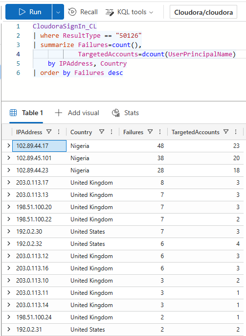
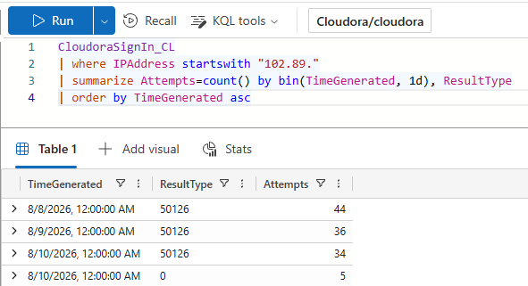
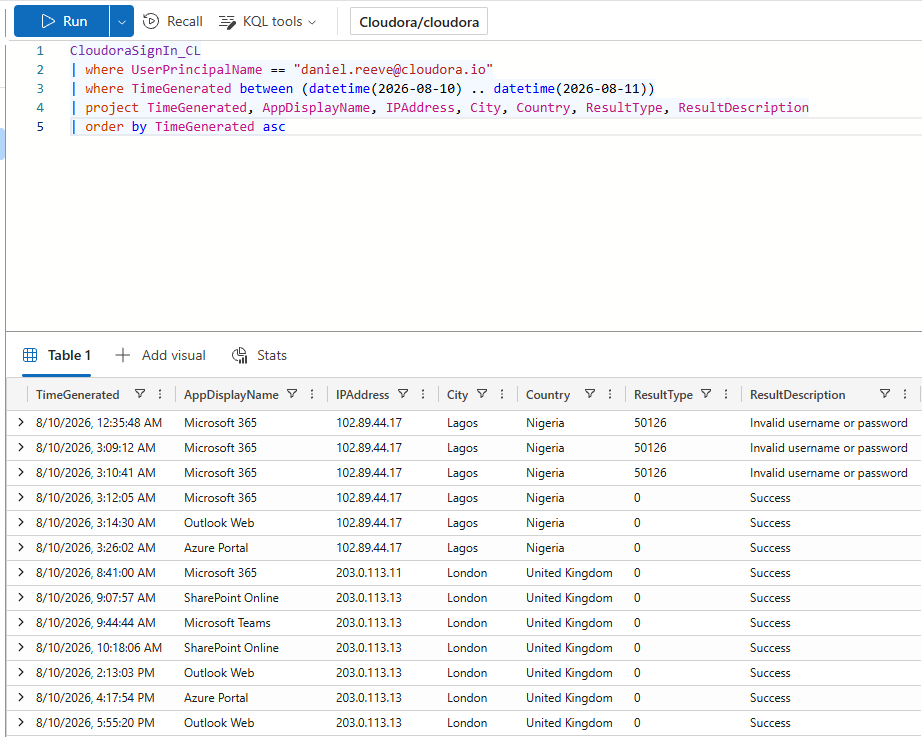
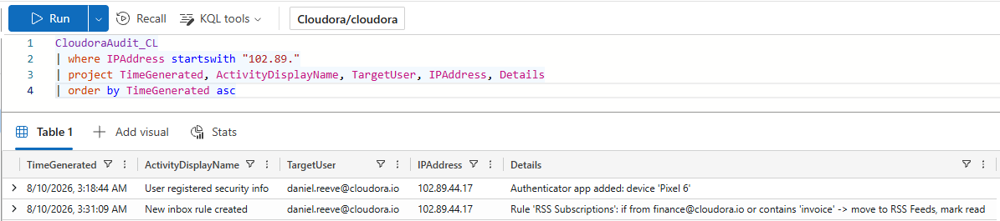
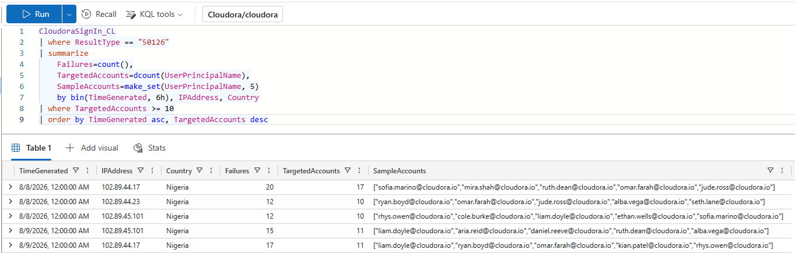
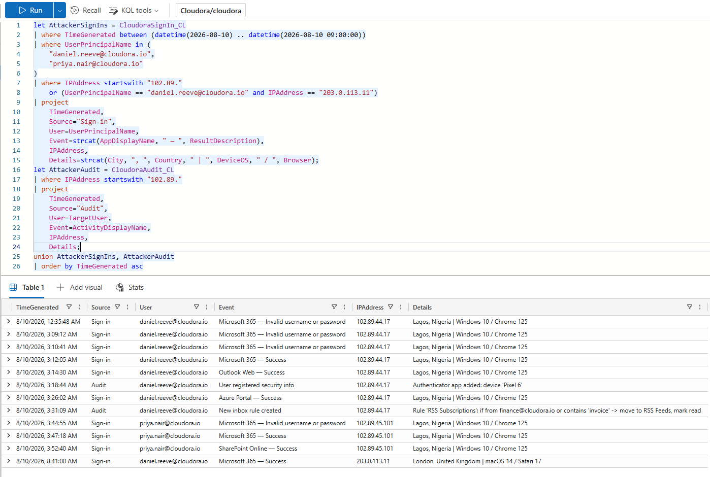

# Project 01 — Cloud Account Takeover Investigation

**Incident ID:** CLD-IR-0001  
**Scenario:** Executive account takeover through password spraying with MFA persistence and BEC staging  
**Severity:** P1  
**Environment:** Synthetic Cloudora SOC engagement

## Overview

This investigation began with suspicious sign-in activity involving Cloudora CEO Daniel Reeve. The investigation expanded beyond the initial alert and identified a broader three-night password-spray campaign.

The analysis confirmed:

- **26 accounts targeted**
- **2 accounts compromised:** Daniel Reeve and Priya Nair
- **24 additional targeted-but-not-breached accounts**
- **3 attacker IP addresses**
- **114 failed authentication attempts** across the campaign
- An unauthorized **Pixel 6 authenticator app** registered on Daniel's account
- A malicious **RSS Subscriptions** inbox rule hiding finance/invoice-related messages
- SharePoint access through the second compromised account
- A travel anomaly for Omar Farah that was investigated and cleared as benign

## Investigation Workflow

1. Validated sign-in and audit-log ingestion.
2. Triaged Daniel Reeve's suspicious Lagos activity.
3. Built a normal-location baseline for the account.
4. Compared the alert with Omar Farah's legitimate Dubai travel.
5. Identified password-spray infrastructure using failed-login aggregation.
6. Confirmed the three-night attack window.
7. Investigated post-compromise persistence in the audit log.
8. Scoped successful attacker sign-ins to identify additional victims.
9. Checked the second victim for persistence.
10. Built a detection query for low-and-slow password spraying.
11. Produced a combined incident timeline and formal incident report.

## Key Findings

### 1. Password spraying

Three Lagos IP addresses generated failed authentications across many users while making only a small number of attempts per account. This pattern was consistent with password spraying rather than repeatedly brute-forcing a single account.

The activity was spread across three consecutive nights, helping the campaign stay relatively low-volume while still targeting a wide set of users.

### 2. Daniel Reeve account compromise

Daniel's account was successfully accessed from Lagos using Windows 10 / Chrome 125 after preceding failed attempts. His established activity was primarily London-based, and the Lagos access was followed by Outlook Web and Azure Portal activity.

### 3. Persistence and BEC staging

After gaining access to Daniel's account, the attacker:

- Registered an unauthorized authenticator application named **Pixel 6**
- Created an inbox rule named **RSS Subscriptions**
- Configured the rule to hide finance- and invoice-related messages

These audit events showed that a password reset alone would not have been sufficient containment.

### 4. Second compromised account

Scoping successful authentications from the attacker infrastructure identified **Priya Nair** as a second compromised user. Her account was successfully accessed from the same attacker-controlled infrastructure, followed by SharePoint Online access.

### 5. False-positive validation

Omar Farah's Dubai sign-ins were assessed as legitimate travel based on timing, successful first-attempt authentication, normal device/browser usage, and repeated activity across multiple days. This comparison demonstrated why unusual geography alone is not enough to label activity malicious.

### 6. Detection opportunity

A password-spray detection rule was developed to identify a single IP generating failed authentications across at least 10 distinct accounts within a six-hour window. The investigation showed that this behavior was detectable before the confirmed compromises occurred.

## Combined Incident Timeline

The final timeline combines attacker sign-ins with audit events to show the incident progression from failed authentication attempts to successful account access, mailbox activity, persistence, malicious rule creation and the discovery of the second victim.

## MITRE ATT&CK Mapping

| Tactic | Technique |
|---|---|
| Credential Access | **T1110.003 — Password Spraying** |
| Initial Access | **T1078 — Valid Accounts** |
| Persistence | **T1098.005 — Device Registration** |
| Defense Evasion | **T1564.008 — Email Hiding Rules** |

## Skills Demonstrated

- KQL threat hunting
- Identity and sign-in log analysis
- Account baselining
- Password-spray detection
- Compromise scoping
- Audit-log investigation
- Persistence analysis
- False-positive validation
- MITRE ATT&CK mapping
- Incident reporting
- Containment and remediation planning
- Detection engineering

## Project Files

- **[Full incident report](./report/Cloudora_Incident_Report_Ahmad-Obeid.pdf)**
- **[KQL investigation queries](./queries/investigation_queries.kql)**
- **[Synthetic datasets](./data/)**
- **[All investigation screenshots](./screenshots/)**

## Training Disclaimer

Cloudora is a fictional organization used for security training. All users, infrastructure, logs, IP addresses and incident activity in this project are synthetic and are documented for defensive security education only.
