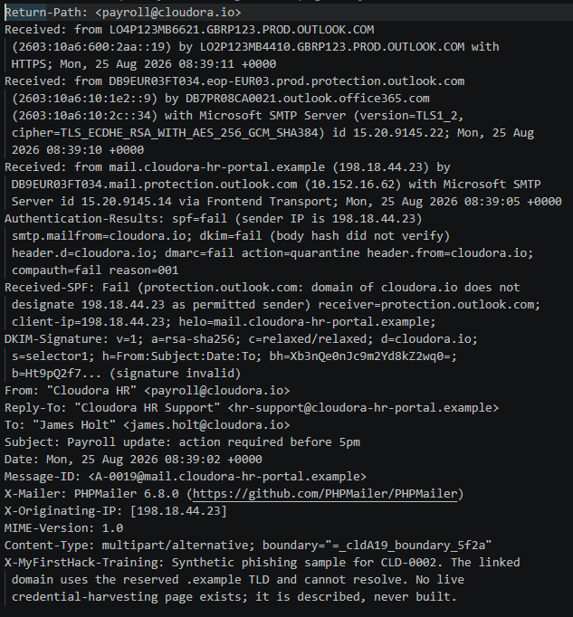
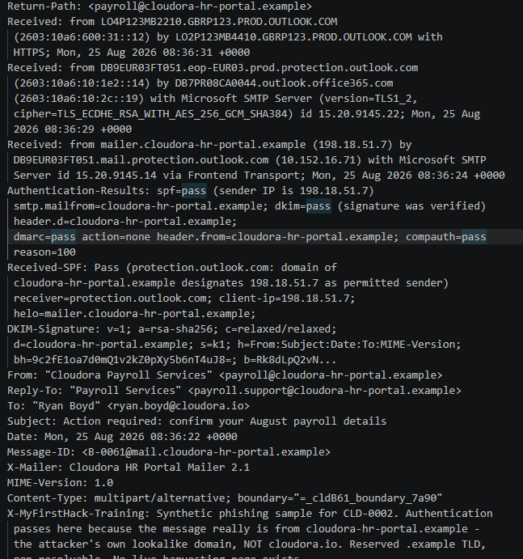
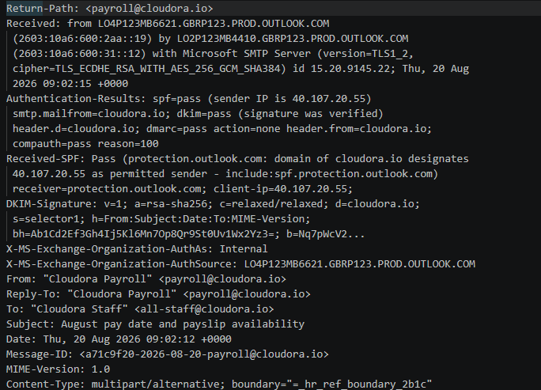
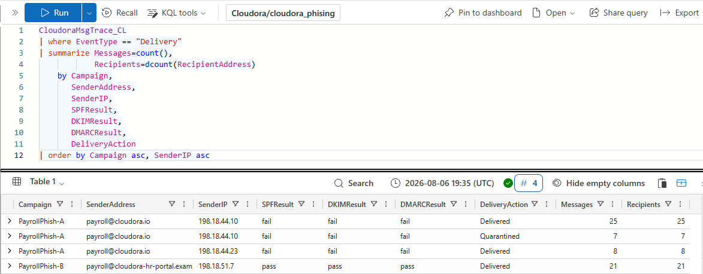
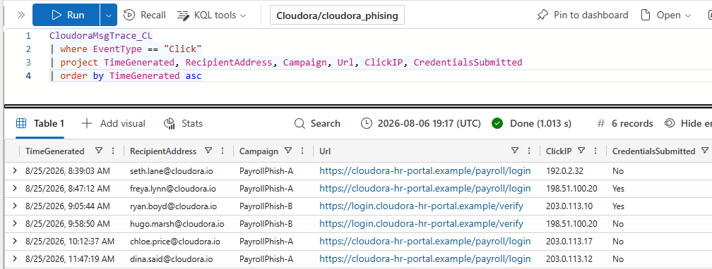
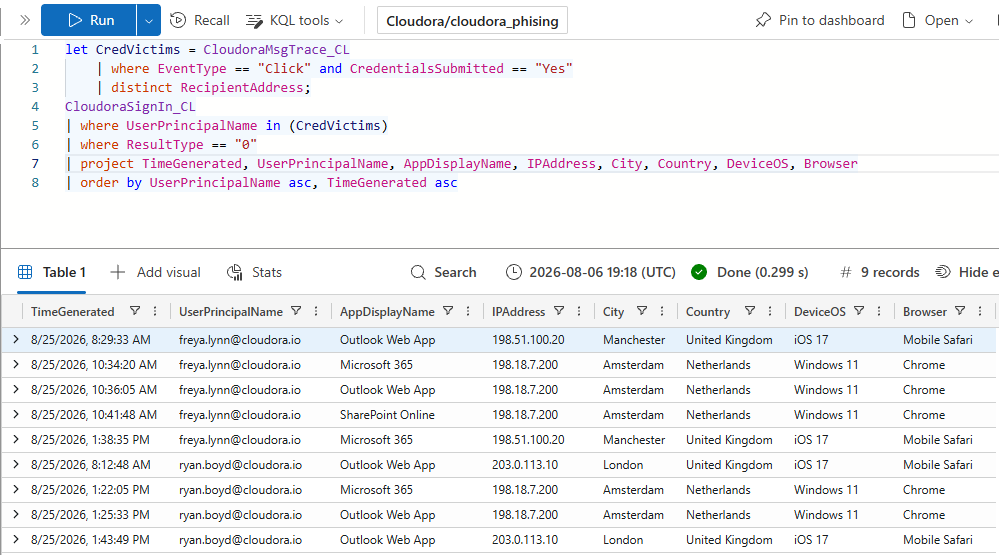
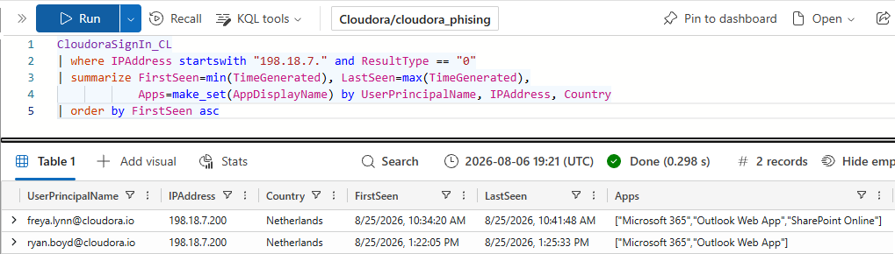
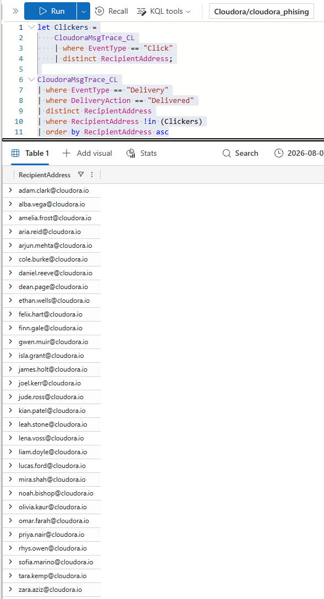
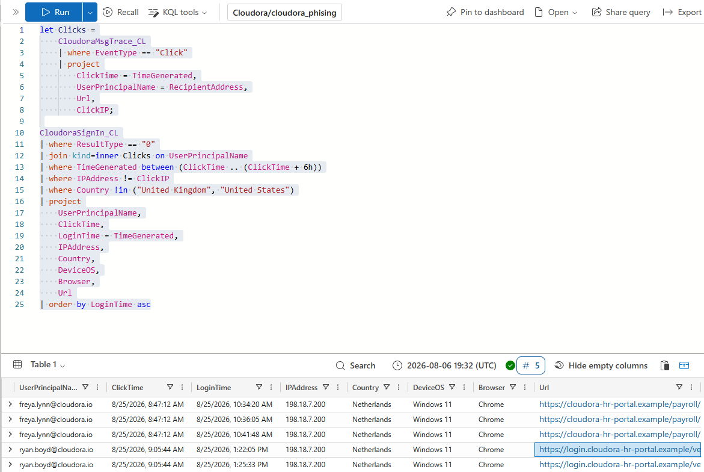

# Project 02 — Payroll Phishing Investigation

**Incident ID:** CLD-IR-0002  
**Scenario:** Payroll-themed credential phishing campaign with two compromised accounts  
**Severity:** P1  
**Environment:** Synthetic Cloudora SOC engagement

## Overview

This investigation began when an employee reported a suspicious payroll email impersonating Cloudora HR.

The case combined **raw email-header analysis**, **message-trace data**, and **cloud sign-in telemetry** to determine campaign scope and confirm whether stolen credentials were actually used.

The investigation confirmed:

- **40 employees targeted**
- **36 users received at least one phishing message**
- **6 users clicked**
- **2 users submitted credentials**
- **2 accounts compromised:** Freya Lynn and Ryan Boyd
- Outlook Web access through both compromised accounts
- SharePoint Online access through Freya's account
- **4 users clicked but did not submit credentials**
- **4 users were fully protected by quarantine**
- A legitimate Cloudora newsletter was investigated and cleared as benign

## Investigation Workflow

1. Triaged the employee-reported payroll email.
2. Examined the raw `.eml` headers and Received chain.
3. Reviewed SPF, DKIM, DMARC and Microsoft composite authentication.
4. Identified Reply-To and domain mismatches.
5. Compared suspicious messages with known-good Cloudora email.
6. Distinguished direct domain spoofing from an authenticated lookalike domain.
7. Loaded message-trace and sign-in data into Azure Data Explorer.
8. Scoped campaign delivery and quarantine actions with KQL.
9. Identified users who clicked and users who submitted credentials.
10. Correlated credential submission with later successful sign-ins.
11. Pivoted on attacker infrastructure to identify the second compromised account.
12. Identified near-miss users and unaffected recipients.
13. Drafted user communications and detection logic.

## Key Findings

### 1. Variant A — spoofed Cloudora sender

Variant A impersonated `payroll@cloudora.io`, but the message originated from attacker-controlled infrastructure.

The header analysis showed:

- SPF failed
- DKIM failed
- DMARC failed
- Reply-To pointed to the lookalike domain
- The phishing link led to a fake payroll portal

### 2. Variant B — authenticated lookalike domain

Variant B used `cloudora-hr-portal.example`, a lookalike domain controlled by the attacker.

In this case, **SPF, DKIM and DMARC all passed** because the email was genuinely authorized for the attacker's own domain.

This demonstrates an important email-security principle:

> **Email authentication passing does not prove that the sender is the legitimate organization. It proves that the message is authorized for the domain it actually came from.**

### 3. Legitimate-mail comparison

A known-good Cloudora payroll message was used as a baseline. It passed authentication for the genuine `cloudora.io` domain, used a matching Reply-To address, linked to the legitimate HR portal, and did not request passwords or bank details by email.

### 4. Campaign scoping

Message-trace analysis showed that the campaign used two different phishing approaches:

- **PayrollPhish-A:** spoofed `cloudora.io`; authentication failed; some messages were quarantined and some delivered.
- **PayrollPhish-B:** used the lookalike domain; authentication passed for the attacker's domain and messages were delivered.

### 5. Credential submission

Six users clicked phishing links, but only two submitted credentials.

The message-trace data identified **Freya Lynn** and **Ryan Boyd** as credential-submission victims.

### 6. Stolen credentials were used

Freya Lynn's credentials were later used to successfully authenticate from **198.18.7.200 in Amsterdam** using **Windows 11 / Chrome**, which did not match her normal Manchester device and location baseline.

The attacker then accessed:

- Microsoft 365
- Outlook Web
- SharePoint Online

Pivoting on the attacker IP revealed a second compromised account: **Ryan Boyd**.

### 7. Near-miss users

The investigation also separated:

- users who clicked but did not submit credentials
- users who received the phish but did not click
- users whose messages were quarantined

This reduced unnecessary escalation while still identifying accounts that required precautionary action.

### 8. Detection engineering

A detection query was developed to identify a phishing click followed by a successful foreign sign-in within a short time window.

The rule correctly surfaced the two confirmed compromised accounts while remaining silent on the users who clicked without being compromised.

## MITRE ATT&CK Mapping

| Tactic | Technique |
|---|---|
| Initial Access | **T1566.002 — Phishing: Spearphishing Link** |
| Credential Access | **T1598.003 — Phishing for Information: Spearphishing Link** |
| Initial Access | **T1078.004 — Valid Accounts: Cloud Accounts** |

## Recommended Response Actions

Because this is a historical training scenario, the response actions were documented rather than executed. The recommended actions included:

- revoke active sessions and refresh tokens for both compromised users
- reset compromised credentials
- re-register and enforce MFA
- block the identified phishing infrastructure
- purge delivered phishing messages
- review Freya's SharePoint activity and both victims' mailbox activity
- strengthen lookalike-domain detection
- move the genuine domain toward stronger DMARC enforcement
- deploy the phishing-click-to-foreign-sign-in detection rule

## Skills Demonstrated

- Phishing triage
- Raw email-header analysis
- SPF / DKIM / DMARC interpretation
- Received-chain analysis
- Lookalike-domain investigation
- Message-trace analysis
- KQL threat hunting
- Credential-compromise validation
- Cloud sign-in investigation
- Campaign scoping
- False-positive analysis
- User communication drafting
- Detection engineering
- MITRE ATT&CK mapping
- Incident reporting and response planning

## Project Files

- **[Full incident report](./report/Cloudora_Incident_Report_Ahmad-Obeid-CLD-IR-0002.pdf)**
- **[KQL query pack](./queries/kql_query_pack.txt)**
- **[Phishing header-analysis checklist](./email-analysis/phishing_header_analysis_checklist.txt)**
- **[Synthetic datasets](./data/)**
- **[Raw email samples](./email-samples/)**
- **[All investigation screenshots](./screenshots/)**

## Training Disclaimer

Cloudora is a fictional organization used for security training. All identities, logs, domains, IP addresses and phishing samples in this project are synthetic. The `.example` domain is reserved and non-resolvable, and no live credential-harvesting page was created.
